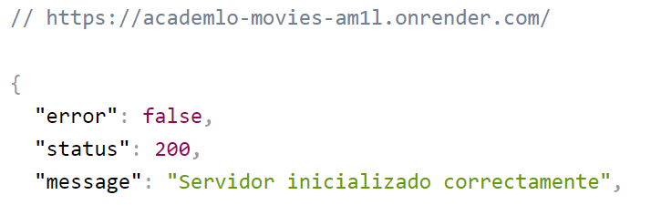

<!-- Improved compatibility of back to top link: See: https://github.com/othneildrew/Best-README-Template/pull/73 -->

<a name="readme-top"></a>

<!--
*** Thanks for checking out the Best-README-Template. If you have a suggestion
*** that would make this better, please fork the repo and create a pull request
*** or simply open an issue with the tag "enhancement".
*** Don't forget to give the project a star!
*** Thanks again! Now go create something AMAZING! :D
-->

<!-- PROJECT SHIELDS -->
<!--
*** I'm using markdown "reference style" links for readability.
*** Reference links are enclosed in brackets [ ] instead of parentheses ( ).
*** See the bottom of this document for the declaration of the reference variables
*** for contributors-url, forks-url, etc. This is an optional, concise syntax you may use.
*** https://www.markdownguide.org/basic-syntax/#reference-style-links
-->

[![Contributors][contributors-shield]][contributors-url]
[![Forks][forks-shield]][forks-url]
[![Stargazers][stars-shield]][stars-url]
[![Issues][issues-shield]][issues-url]
[![MIT License][license-shield]][license-url]
[![LinkedIn][linkedin-shield]][linkedin-url]

<!-- PROJECT LOGO -->
<br />
<div align="center">

<h1 align="center">Academovies</h1>
  <a href="ttps://github.com/Lanyev/academovies">
    
  </a>

  <p align="center">
   Academovies es un proyecto que busca crear una base de datos tipo Netflix para películas y series educativas. La plataforma tiene como objetivo proporcionar una selección de contenido de alta calidad que permita a los usuarios aprender de manera divertida y efectiva.
    <br />
    <a href="https://github.com/Lanyev/academovies"><strong>Explore the docs »</strong></a>
    <br />
    <br />
    <a href="https://academlo-movies-am1l.onrender.com">View Demo</a>
    ·
    <a href="https://github.com/Lanyev/academovies/issues">Report Bug</a>
    ·
    <a href="https://github.com/Lanyev/academovies/issues">Request Feature</a>
  </p>
</div>

<!-- TABLE OF CONTENTS -->
<details>
  <summary>Table of Contents</summary>
  <ol>
    <li>
      <a href="#about-the-project">About The Project</a>
      <ul>
        <li><a href="#built-with">Built With</a></li>
      </ul>
    </li>
    <li>
      <a href="#getting-started">Getting Started</a>
      <ul>
        <li><a href="#prerequisites">Prerequisites</a></li>
        <li><a href="#installation">Installation</a></li>
      </ul>
    </li>
    <li><a href="#usage">Usage</a></li>
    <li><a href="#roadmap">Roadmap</a></li>
    <li><a href="#contributing">Contributing</a></li>
    <li><a href="#license">License</a></li>
    <li><a href="#contact">Contact</a></li>
    <li><a href="#acknowledgments">Acknowledgments</a></li>
  </ol>
</details>

<!-- ABOUT THE PROJECT -->

## Acerca del Proyecto

En el proyecto Academovies se ha desarrollado una base de datos de películas y series educativas utilizando Next.js, Firebase y Render.

La plataforma permite a los usuarios buscar películas y series, agregarlas a su lista de favoritos, ver detalles de la película o serie, calificarlas y ver las calificaciones de otros usuarios. Además, se han implementado categorías para clasificar las películas y series por temas específicos.

Los usuarios pueden registrarse y tener su propio perfil, desde donde pueden editar sus datos personales. La plataforma no tiene historial de visualización ni comentarios.

El proyecto ha sido una experiencia desafiante y enriquecedora que nos ha permitido aplicar nuestros conocimientos en Node.js y aprender nuevas tecnologías.

<p align="right">(<a href="#readme-top">back to top</a>)</p>

### Built With

- [![Next][next.js]][next-url]
- [![React][react.js]][react-url]
- [![JQuery][jquery.com]][jquery-url]

<p align="right">(<a href="#readme-top">back to top</a>)</p>

<!-- GETTING STARTED -->

## Iniciación

### Prerrequisitos

- npm
  ```sh
  npm install npm@latest -g
  ```

### Instalacion

1. Clona el repo
   ```sh
   git clone ttps://github.com/Lanyev/academovies
   ```
2. Install NPM packages
   ```sh
   npm install
   ```
3. Modifica el `example.env` y renombralo a `.env` y agrega la siguiente informacion.

   ```js
   const PORT = 'ENTER YOUR API';
   const HOST = 'ENTER YOUR HOST';
   const NODE_ENV = 'ENTER YOUR NODE_ENV';
   const JWT_SECRET = 'ENTER YOUR JWT_SECRET';

   DB_HOST = 'ENTER YOUR DB_HOST';
   DB_PORT = 'ENTER YOUR DB_PORT';
   DB_USER = 'ENTER YOUR DB_USER';
   DB_PASSWORD = 'ENTER YOUR DB_PASSWORD';

   FIREBASE_API_KEY = 'ENTER YOUR FIREBASE_API_KEY';
   FIREBASE_AUTH_DOM = 'ENTER YOUR FIREBASE_AUTH_DOM';
   FIREBASE_PROJECT_ID = 'ENTER YOUR FIREBASE_PROJECT_ID';
   FIREBASE_STORAGE_BUCKET = 'ENTER YOUR FIREBASE_STORAGE_BUCKET';
   ```

<p align="right">(<a href="#readme-top">back to top</a>)</p>

<!-- USAGE EXAMPLES -->

<!-- CONTRIBUTING -->

## Contribución

Las contribuciones son lo que hacen que la comunidad de código abierto sea un lugar increíble para aprender, inspirarse y crear. Cualquier contribución que realices será muy apreciada.

Si tienes una sugerencia que podría mejorar el proyecto, por favor haz un fork del repositorio y crea una pull request. También puedes simplemente abrir un issue con la etiqueta "mejora".
¡No olvides darle al proyecto una estrella! ¡Gracias de nuevo!

1. Haz un fork del proyecto.
2. Crea tu rama de características (`git checkout -b feature/AmazingFeature`)
3. Haz commit de tus cambios (`git commit -m 'Add some AmazingFeature'`)
4. Haz push a la rama (`git push origin feature/AmazingFeature`)
5. Abre una pull request.

<p align="right">(<a href="#readme-top">back to top</a>)</p>

<!-- CONTACT -->

## Contacto

Alan Yeverino -[Twitter](https://twitter.com/Lanyev) - [Mail](yeverinoalan@gmail.com)

Project Link: [Link](https://github.com/Lanyev/academovies)

<p align="right">(<a href="#readme-top">back to top</a>)</p>

<!-- MARKDOWN LINKS & IMAGES -->
<!-- https://www.markdownguide.org/basic-syntax/#reference-style-links -->

[contributors-shield]: https://img.shields.io/github/contributors/github_username/repo_name.svg?style=for-the-badge
[contributors-url]: https://github.com/github_username/repo_name/graphs/contributors
[forks-shield]: https://img.shields.io/github/forks/github_username/repo_name.svg?style=for-the-badge
[forks-url]: https://github.com/github_username/repo_name/network/members
[stars-shield]: https://img.shields.io/github/stars/github_username/repo_name.svg?style=for-the-badge
[stars-url]: https://github.com/github_username/repo_name/stargazers
[issues-shield]: https://img.shields.io/github/issues/github_username/repo_name.svg?style=for-the-badge
[issues-url]: https://github.com/github_username/repo_name/issues
[license-shield]: https://img.shields.io/github/license/github_username/repo_name.svg?style=for-the-badge
[license-url]: https://github.com/github_username/repo_name/blob/master/LICENSE.txt
[linkedin-shield]: https://img.shields.io/badge/-LinkedIn-black.svg?style=for-the-badge&logo=linkedin&colorB=555
[linkedin-url]: https://linkedin.com/in/lanyev
[product-screenshot]: images/screenshot.png
[next.js]: https://img.shields.io/badge/next.js-000000?style=for-the-badge&logo=nextdotjs&logoColor=white
[next-url]: https://nextjs.org/
[react.js]: https://img.shields.io/badge/React-20232A?style=for-the-badge&logo=react&logoColor=61DAFB
[react-url]: https://reactjs.org/
[vue.js]: https://img.shields.io/badge/Vue.js-35495E?style=for-the-badge&logo=vuedotjs&logoColor=4FC08D
[vue-url]: https://vuejs.org/
[angular.io]: https://img.shields.io/badge/Angular-DD0031?style=for-the-badge&logo=angular&logoColor=white
[angular-url]: https://angular.io/
[svelte.dev]: https://img.shields.io/badge/Svelte-4A4A55?style=for-the-badge&logo=svelte&logoColor=FF3E00
[svelte-url]: https://svelte.dev/
[laravel.com]: https://img.shields.io/badge/Laravel-FF2D20?style=for-the-badge&logo=laravel&logoColor=white
[laravel-url]: https://laravel.com
[bootstrap.com]: https://img.shields.io/badge/Bootstrap-563D7C?style=for-the-badge&logo=bootstrap&logoColor=white
[bootstrap-url]: https://getbootstrap.com
[jquery.com]: https://img.shields.io/badge/jQuery-0769AD?style=for-the-badge&logo=jquery&logoColor=white
[jquery-url]: https://jquery.com
