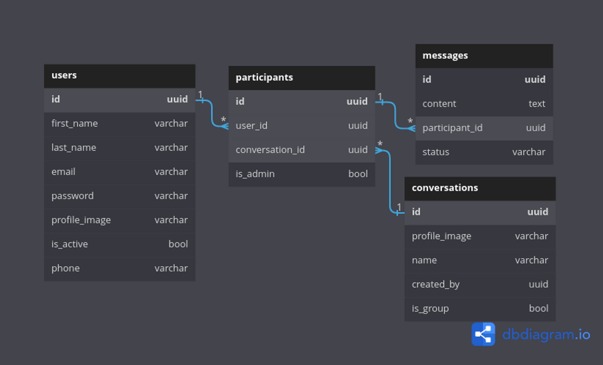

README
Introducción
Este proyecto es una API que se conecta a una base de datos con la estructura mostrada en el siguiente diagrama:

La aplicación tiene en cuenta el manejo de usuarios, rutas protegidas, conversaciones de usuarios y mensajería.

Usuarios
La entidad de usuarios cuenta con las acciones básicas de CRUD. Además, se ha agregado autenticación y autorización a través de una ruta para iniciar sesión que retorna un token.

Conversaciones
Las acciones de CRUD sobre conversaciones están protegidas para que solo los usuarios logueados puedan generar estas acciones. Al obtener conversaciones, solo se muestran las conversaciones que tiene ese usuario.

Mensajes
Se pueden obtener, crear y eliminar mensajes, pero solo si pertenecen a una conversación. Además, solo se puede eliminar un mensaje si el creador del mensaje es el usuario logueado.

Tecnologías utilizadas
Node.js
Express.js
MongoDB
JSON Web Tokens (JWT)
Instalación
Para utilizar esta API, siga los siguientes pasos:

Clonar este repositorio.
Ejecutar npm install en la terminal para instalar las dependencias.
Crear un archivo .env con las variables de entorno DB_URI (la conexión a la base de datos MongoDB) y JWT_SECRET (la clave secreta para firmar el token).
Ejecutar npm start en la terminal para iniciar el servidor.
Contribuir
Si desea contribuir a este proyecto, puede realizar un fork del repositorio y enviar pull requests. También puede abrir issues si encuentra algún problema o desea sugerir mejoras.

Licencia
Este proyecto está bajo la Licencia MIT. Consulte el archivo LICENSE para más detalles.
